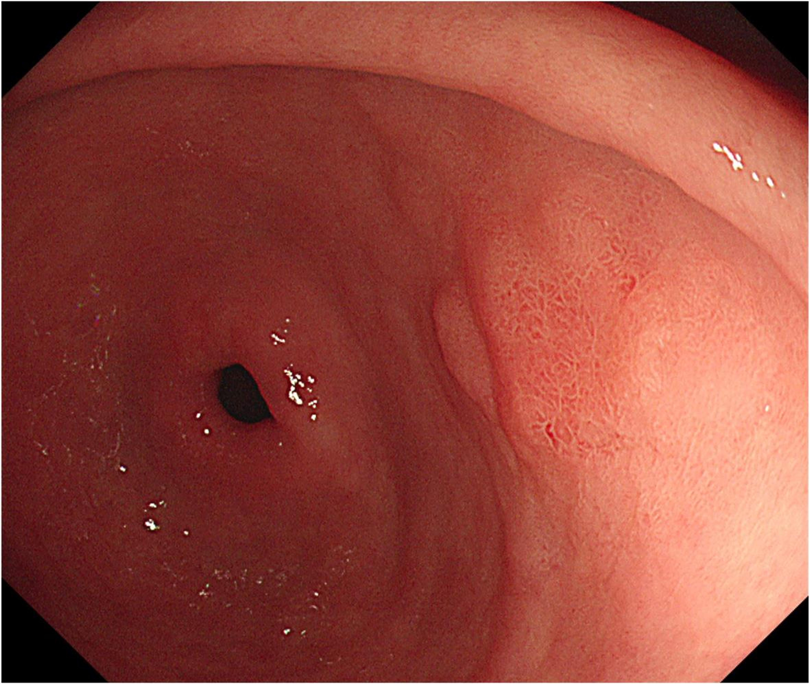

# TSP-SAM

**Implementation for "*Task-Specified SAM Multi-task Gastric Cancer Diagnosis in Endoscopic Images*"**

### 1. Data Prepare

#### Dataset Annotation Format

The dataset is organized via a text file in which each line corresponds to one image sample. Each line includes the relative image path and three associated clinical labels, separated by spaces:

 ----_[image_path] [pathological_type_label] [differentiation_label] [invasion_depth_label]_

**Images and annotations examples**

| Image_Path                                                   | pathological | differentiation | infiltration | segmentation |
| ------------------------------------------------------------ | ------------ | --------------- | ------------ | ------------ |
|  |       Benign       |          -       |       -       |              |
|  |       Benign       |          -       |       -       |              |
|  |       Maligant     |         Poorly differentiated        |       Submucosal       |              |
|  |       Maligant       |         Well differentiated        |      Mucosal        |              |

The descriptions of the above examples:

images/001.jpg 0 2 2

images/002.jpg 1 0 0

images/003.jpg 1 1 1

This annotation file is used for both training and validation splits and should be formatted consistently.

 

#### Label Definitions

The multi-task labels are assigned based on pathological reports and expert annotation. The detailed category definitions are as follows:

**Task I. Pathological Type (binary classification):**

- **Label 0**: Benign lesions, including inflammation, intestinal metaplasia, and low-grade intraepithelial neoplasia.
- **Label 1**: Malignant or pre-malignant lesions, including high-grade intraepithelial neoplasia and adenocarcinoma.

 

**Task II. Differentiation Degree (three-class classification)**

-  **Label 0**: Poorly differentiated types, including poorly and moderately-poorly differentiated adenocarcinoma.
-  **Label 1**: Well to moderately differentiated types, including moderately, moderately-well, and well-differentiated adenocarcinoma.
-  **Label 2:** Benign lesion or High-grade intraepithelial neoplasia (HGIN), which does not yet show invasive behavior but is clinically treated as an early malignant lesion. It is thus separated into its own category.

 

**Task III. Infiltration Depth (three-class classification)**

- **Label 0:** Submucosal invasion.
- **Label 1:** Intra-mucosal invasion, including the mucosal layer and muscularis mucosa.
- **Label 2:** Benign or HGIN, which lacks stromal invasion but is treated with similar caution. It is assigned a separate category.

**Segmentation**

For lesion segmentation tasks, each input image is paired with a corresponding binary segmentation mask. The naming convention and format are standardized as follows:

For an image file named image1.jpg, its corresponding segmentation label should be named image1_mask.jpg.
